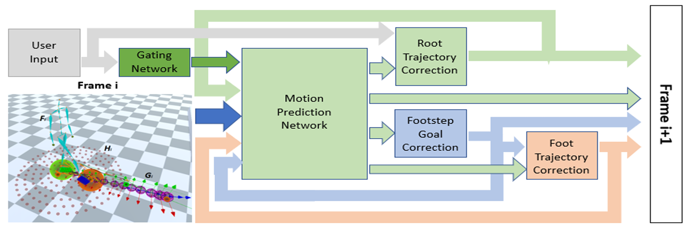

## Master's Thesis: Stair Walking Animation

Here you can find the scripts i used for my Master's Thesis: "Natural and Accurate Stair Walking Synthesis for Character Control using Environment Information". 

This work is an extension of the paper by Sebastian Starke ["Neural State Machine for Character-Scene Interactions"](https://github.com/sebastianstarke/AI4Animation/tree/master/AI4Animation/SIGGRAPH_Asia_2019). The code was extended so that a trained model was able to generate stair walking animation:

Extensions of the model include estimation of footstep goals and trajectories that are also used as feedback for the next iterations during runtime. In the following picture, a general diagram of the model is shown:

For more details about the training data processing, code implementation and results, please refer to the [PDF of the Thesis](MasterThesisRMS.pdf).
